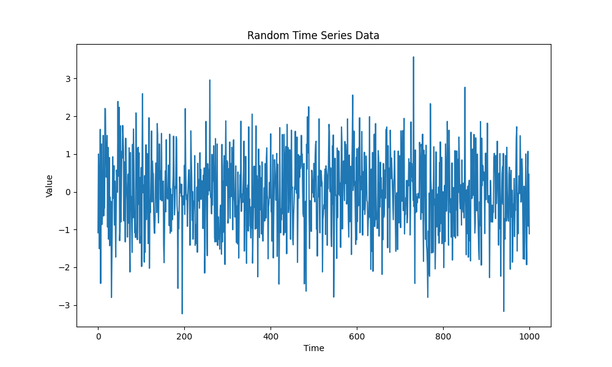

# 数据来自sklearn的肿瘤数据，是一个二分类问题



### 代码解析：
导入了numpy、pandas、matplotlib和statsmodels这四个库，它们分别用于数值计算、数据处理、数据可视化和统计建模。  

使用numpy的random.normal函数生成了一个服从正态分布的随机时间序列数据集，它有1000个观测值，把它转换成pandas的Series对象，方便后续操作。  

使用matplotlib的plot函数绘制了数据图像，可以看到数据呈现出一定的波动性，没有明显的趋势或周期性。  

定义并拟合了一个ARIMA(2,1,2)模型，这个模型表示自回归阶数为2，差分阶数为1，移动平均阶数为2。  

使用statsmodels的ARIMA类创建了一个模型对象，并传入数据和模型参数。然后调用fit方法来拟合模型，并得到一个model_fit对象。  

打印了model_fit对象的summary方法和params属性，可以看到模型的摘要信息和参数估计值。  

使用model_fit对象的resid属性得到了残差序列，并把它转换成pandas的DataFrame对象。  

再次使用matplotlib的plot函数绘制了残差图像，可以看到残差大致呈现出白噪声的特征，没有明显的相关性或异方差性。  

计算了残差序列的均方误差（MSE），这是一种衡量模型拟合效果的指标。MSE越小表示模型越能够准确地预测数据。  

使用model_fit对象的forecast方法来预测未来10个时间点的值，并得到一个forecast数组。  

再次使用matplotlib的plot函数绘制了预测图像，并与原始数据进行对比。可以看到预测值大致延续了原始数据的波动范围。  

ARIMA模型的损失函数是对数似然函数（log-likelihood function）

ARIMA模型的优化算法是最大似然估计（maximum likelihood estimation）

### 图表分析；
```python
很少用，就不做解析了
```
