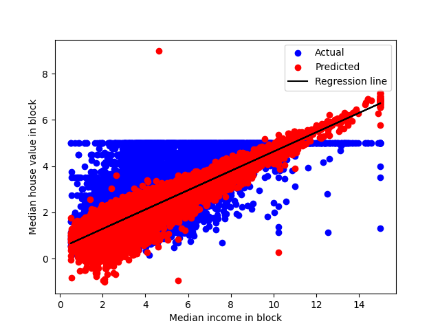

# 数据来自sklearn的房价数据
## 运行结果：
```python
Coefficients: [
    4.36693293e-01  9.43577803e-03 -1.07322041e-01  6.45065694e-01
    -3.97638942e-06 -3.78654265e-03 -4.21314378e-01 -4.34513755e-01
]
Intercept: -36.94192020718445
Mean squared error: 0.5243209861846072  # 有优化空间
```



展示区域内收入中位数（横轴）和区域内房屋价值中位数（纵轴）之间的关系。  

蓝色的点表示实际的数据，红色的点表示模型预测的数据，黑色的线表示回归线，也就是模型拟合出来的最佳直线。  

可以看到，回归线大致能够捕捉到收入和房价之间的正相关趋势，但是也有一些偏差和误差。  

输出的结果是模型参数和均方误差。  

模型参数包括系数（Coefficients）和截距（Intercept），它们决定了回归线的斜率和位置。  

均方误差（Mean squared error）是用来衡量模型预测值和真实值之间的误差，它越小表示模型越准确。  

可以看到，这个模型的均方误差是0.5243，这个值并不很小，说明模型还有改进的空间。  

注意：使用的损失函数与优化算法采用的是默认的最小二乘法

