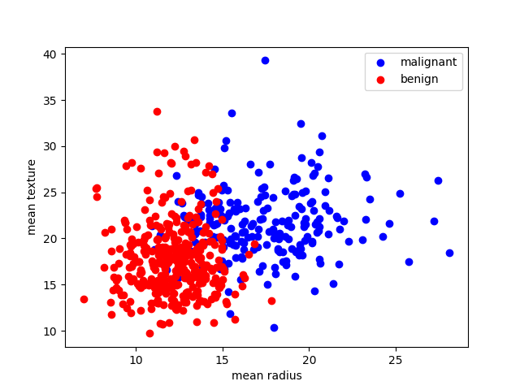

# 数据来自sklearn的肿瘤数据，是一个二分类问题
## 运行结果：
```python
Data shape: (569, 30)
Feature names: ['mean radius' 'mean texture' 'mean perimeter' 'mean area'
 'mean smoothness' 'mean compactness' 'mean concavity'
 'mean concave points' 'mean symmetry' 'mean fractal dimension'
 'radius error' 'texture error' 'perimeter error' 'area error'
 'smoothness error' 'compactness error' 'concavity error'
 'concave points error' 'symmetry error' 'fractal dimension error'
 'worst radius' 'worst texture' 'worst perimeter' 'worst area'
 'worst smoothness' 'worst compactness' 'worst concavity'
 'worst concave points' 'worst symmetry' 'worst fractal dimension']
Target names: ['malignant' 'benign']
Accuracy: 1.0
Confusion matrix:
 [[44  0]
 [ 0 70]]
```



这份可视化图是为了展示数据集的分布情况，它只选取了前两个特征（mean radius和mean texture）进行绘图，因为如果要绘制所有30个特征的图，就需要使用高维空间。  

可以看到，红色的点表示良性肿瘤（benign），蓝色的点表示恶性肿瘤（malignant），横轴表示mean radius，纵轴表示mean texture。  

从图中可以看出，良性肿瘤和恶性肿瘤在这两个特征上有一定的区分度，但也有一些重叠的部分。  

逻辑回归模型就是要找到一个合适的决策边界（decision boundary），将两类样本尽可能地分开。  

它的损失函数是交叉熵损失（cross-entropy loss）。

它的优化算法是牛顿-共轭梯度法（Newton-CG），它是一种基于牛顿法（Newton’s method）的二阶优化算法，它可以利用海森矩阵（Hessian matrix）的信息来加速收敛过程。
